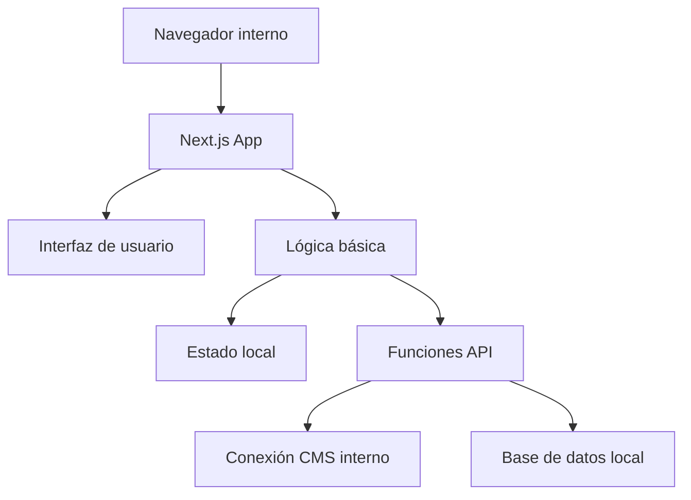

# Creative Services Platform - Patrones del Sistema

## Arquitectura Básica

### Vista General
La herramienta utiliza una estructura simple basada en Next.js con componentes específicos para nuestra necesidad interna:

### Componentes Principales

#### Capa de Interfaz
- **Componentes UI**: React básico con TailwindCSS 
- **Formularios**: Campos simples para mapeo de datos
- **Indicadores**: Alertas básicas de compatibilidad
- **Vista Previa**: Visualización básica del contenido

#### Capa de Lógica
- **Transformación Simple**: Conversión básica entre formatos
- **Validación Básica**: Verificación de campos requeridos
- **Estados Simples**: Borrador, revisión y publicado
- **Exportación**: Generación de documentos estándar

#### Capa de Datos
- **Conector Principal**: Integración con nuestro CMS
- **Almacenamiento Local**: Guardado de configuraciones
- **Logs Básicos**: Registro de acciones principales

## Patrones de Diseño Utilizados

### Estructura Simple MVC
- **Modelo**: Tipos básicos en TypeScript
- **Vista**: Componentes React funcionales
- **Controlador**: Funciones básicas de procesamiento

### Gestión de Estado
- **Zustand**: Almacenamiento central simplificado
- **useState/useReducer**: Para estados locales
- **Contexto React**: Para compartir datos entre componentes

### Patrones de UI
- **Formularios Controlados**: Validación básica de entrada
- **Listas Paginadas**: Para mostrar los casos de estudio
- **Feedback Simple**: Mensajes de éxito/error

## Comunicación e Integración

### API Interna
- Endpoints básicos para operaciones CRUD
- Manejo simple de errores
- Autenticación con credenciales internas

### Conexión con Sistemas Internos
- Adaptador para nuestro CMS principal
- Lectura de datos desde hojas de cálculo compartidas
- Exportación a formatos comunes (.docx, .pdf)

### Comunicación entre Componentes
- Props para paso de datos
- Eventos simples para notificaciones
- Context para estado compartido

## Etapas de Desarrollo

### Versión Inicial (Completada)
- Formularios básicos de entrada
- Conexión simple al CMS principal
- Almacenamiento local de datos

### Versión Actual
- Sistema básico de transformación de datos
- Validación mejorada de campos
- Exportación a documentos
- Interfaz refinada para el equipo interno

### Mejoras Futuras
- Plantillas adicionales para diferentes tipos de proyectos
- Integración con sistema de archivos interno
- Búsqueda mejorada por metadatos
- Notificaciones por correo para aprobaciones
